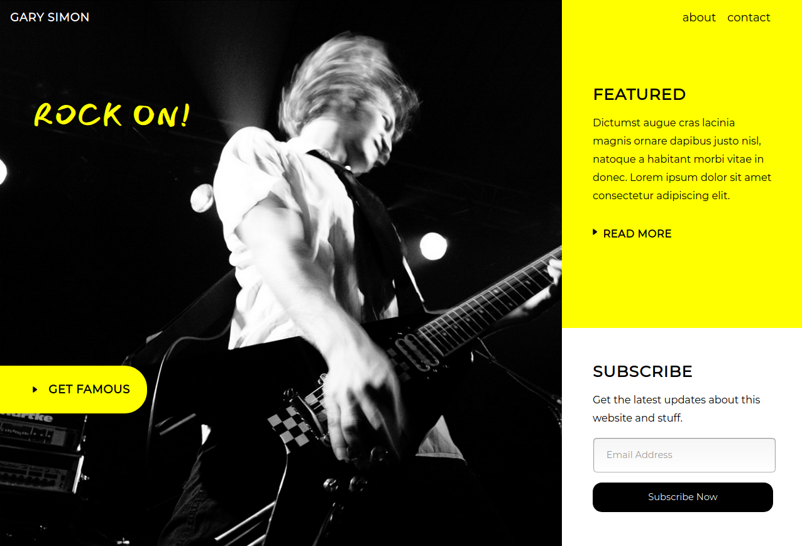
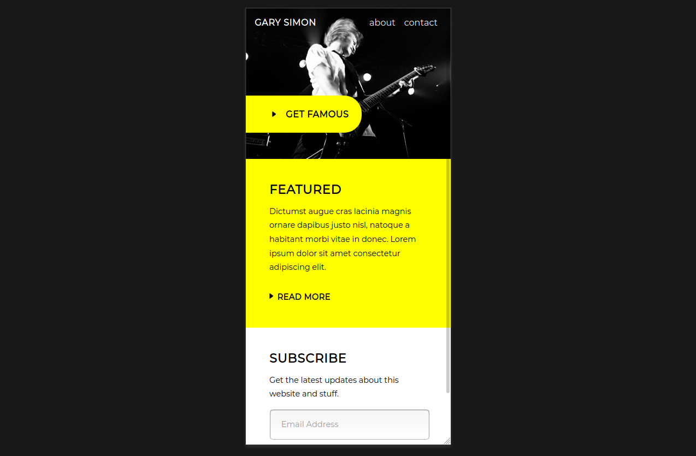

# Musical instruments/musicians landing page.

Full size view

Mobile view

This is my own version of the "Create a Modern Web Design from Scratch" tutorial from DesignCourse. 
It has also been reformatted as a Flask application.

## Technologies used:
* Flask
* SQLAlchemy
* HTML, CSS and Sass.

## Requirements: 
python_version = 3.6+
 

