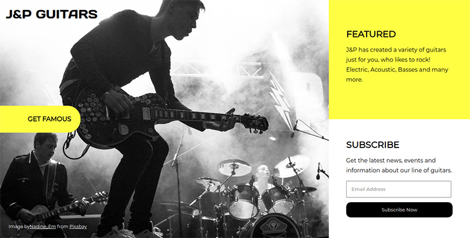
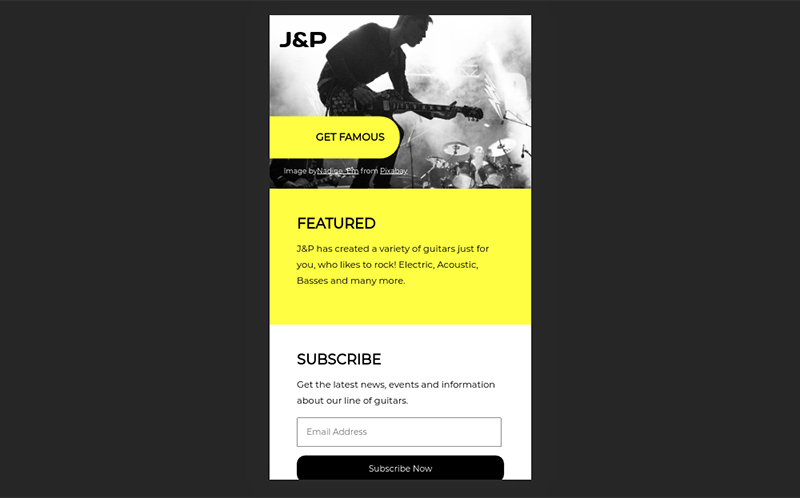

# J&P Guitars landing page

This is a landing page of an imaginary guitar manufacturing company called "J&P Guitars".
Created as a Flask app and using the Flask-mail library, the idea is that this page allows the user subscribe to the company's newsletter and a receive a nice welcome email.

You can visit it as a heroku app here:
https://jpguitars.herokuapp.com/

Full size view

Mobile view

The design and layout of the application was inspired by the DesignCourse tutorial "Creating a modern web design from scratch". 

## Technologies used:
* HTML, CSS and Sass.
* Flask
* Flask-mail

## Requirements: 
python_version = 3.6+
 

